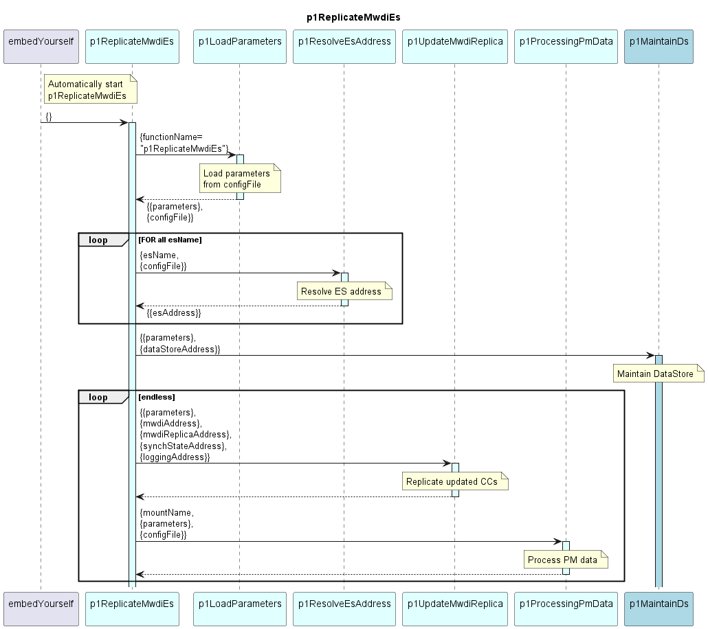

# p1ReplicateMwdiEs  

The p1ReplicateMwdiEs implements a cyclic process.  
The main tasks of this process are:  
- Replicating updated ControlConstructs from the MWDI ES index into the MWDI ES Replica index (which holds the raw data for processing PM data in the DPMDP)  
- Initiating the processing of PM data for the updated ControlConstructs  

### Overview  

After getting started by the embedYourself function, the p1ReplicateMwdiEs ...  
  - loads the parameter values for the entire cyclic PM data processing from the configFile  
  - composes the address information of all the involved ElasticSearch indices  
  - triggers the cyclic execution of the DataStore cleanup  
  - cyclically triggers the replication of the MWDI ES index and the subsequent processing of PM data  

### Diagram  

  

### Interface  

Please find a detailed description of the [interface](./interface.yaml).  

