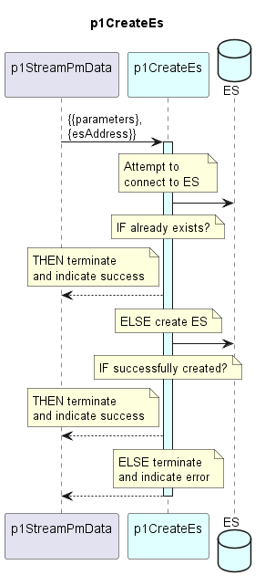

# p1CreateEs

Ensures that the required ES index is available before accessing it.


### Overview

The function performs the following steps:

1. **Check if index exists**
    - Calls ElasticSearch using a HEAD/GET request on `/{es-index}`
    - If the index already exists and is accessible, the function returns
      successfully without making any changes.
    - Sample code:
   ```
    const exists = await es.indices.exists({ index: indexName });
   ```

2. **Create index if missing**
    - If the index does not exist, sends a `PUT /{es-index}` request to the
      configured ElasticSearch URL.
    - Uses the settings and mappings defined in the configuration (if provided)
      to create the index (for example, number of shards/replicas, field types,
      etc.).
    - If index creation succeeds, the function returns successfully.
    - Sample code:

  <!--- todo: the exact code to create the ES with all the required attributes to be added here --->
   ```
   await es.indices.create({
      index: indexName,
      body: indexDefinition || {}
    });
   ```

3. **Error handling**
    - If ElasticSearch is not reachable, the credentials are invalid, or the
      index cannot be created for any other reason, the function returns an
      error description.
    - The caller is expected to log the error.

This function is intentionally generic. It can be used both for indices that
store business data (e.g. PM data, device replicas) and for technical indices
(e.g. logs, replication state), as long as the correct `es-client` configuration
is provided.


### Diagram

<p align="center">
  
</p>


### Interface

Please find a detailed description of the [interface](interface.yaml).


### Variables

Please find a detailed description of the [variables](variables.yaml).
