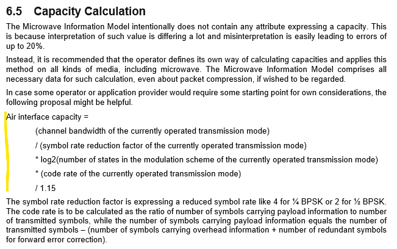
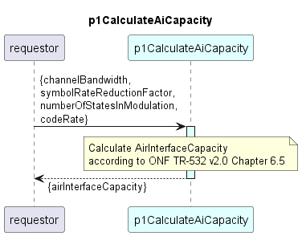

# p1CalculateAiCapacity

Calculates the AirInterface capacity according to ONF TR-532 v2.0.

### Overview

TR-532 v2.0 Chapter 6.5 Capacity Calculation:

	

### Diagram

	

### Interface

Please find a detailed description of the [interface](interface.yaml).

### Variables

Please find a detailed description of the [variables](variables.yaml).

### NPM Module  

[mw-sdn-p1-calculate-ai-capacity](https://www.npmjs.com/package/mw-sdn-p1-calculate-ai-capacity)  

