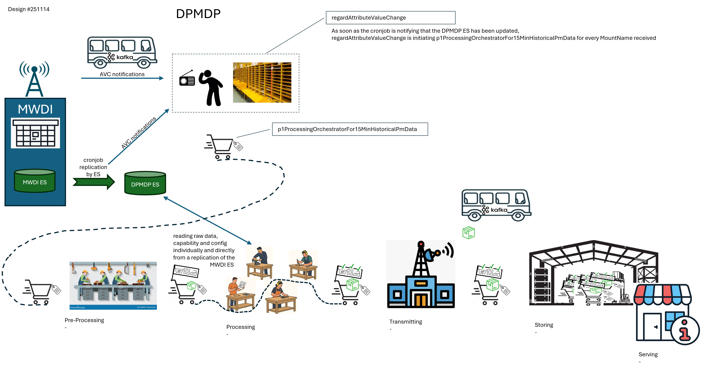
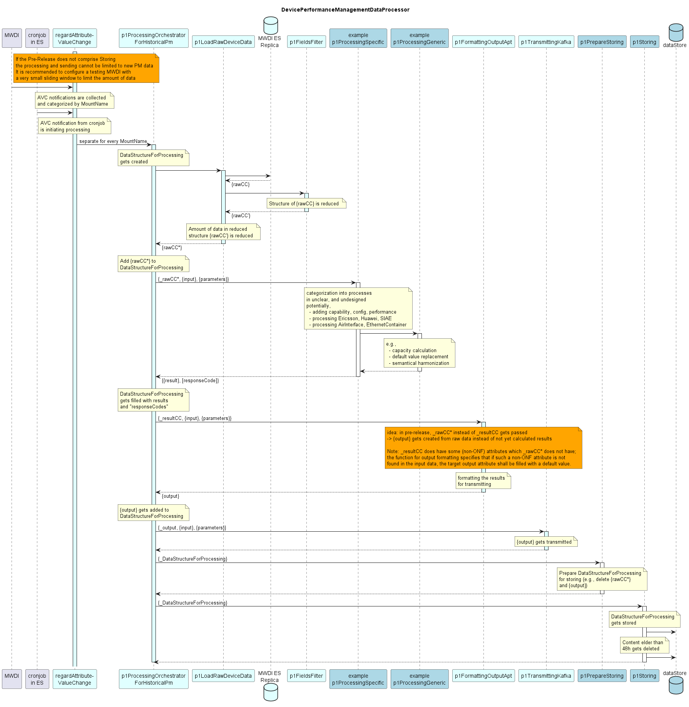

# DevicePerformanceManagementDataProcessor Specification

    The following Functions shall be covered in the Pre-release:
    - regardAttributeValueChange
    - p1ProcessingOrchestratorForHistoricalPm

### API  

**Diagrams:**  
- [Collection of Diagrams](./diagrams)  

**ServiceList:**  
- [DevicePerformanceManagementDataProcessor+services](./DevicePerformanceManagementDataProcessor+services.yaml)  

**ProfileList and ProfileInstanceList:**  
- [DevicePerformanceManagementDataProcessor+profiles](./DevicePerformanceManagementDataProcessor+profiles.yaml)  
- [DevicePerformanceManagementDataProcessor+profileInstances](./DevicePerformanceManagementDataProcessor+profileInstances.yaml)  

**ForwardingList:**  
- [DevicePerformanceManagementDataProcessor+forwardings](./DevicePerformanceManagementDataProcessor+forwardings.yaml)  

**Open API specification (Swagger):**  
- [DevicePerformanceManagementDataProcessor](./DevicePerformanceManagementDataProcessor.yaml)  

**CONFIGfile (JSON):**  
- [DevicePerformanceManagementDataProcessor+config](./DevicePerformanceManagementDataProcessor+config.json)  

**Comments:**  
./.  

### Internal Structure  

**High Level Process:**  

  

**High Level Sequence:**  

  

**List of Functions:**  
- [List of generic Functions](./Functions/genericFunctions)  
- [List of specific Functions](./Functions/specificFunctions)  
