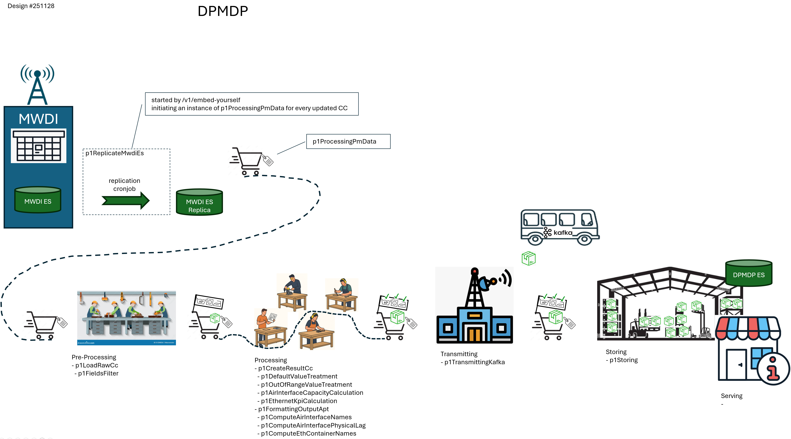
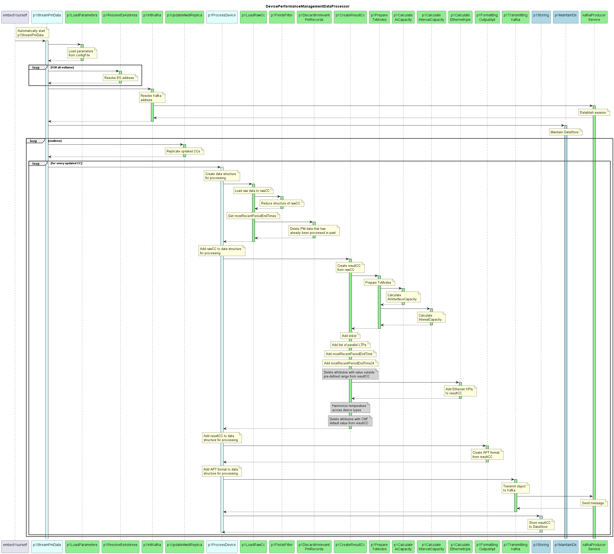

# DevicePerformanceManagementDataProcessor Specification

    The following Functions shall be covered in the Pre-release:
    - regardAttributeValueChange
    - p1ProcessingOrchestratorForHistoricalPm

    Caution:
      If the Pre-Release does not comprise p1Storing
      the processing and sending cannot be limited to new PM data
      It is recommended to configure a testing MWDI with
      a very small sliding window to limit the amount of data 

### API  

**ServiceList:**  
- [DevicePerformanceManagementDataProcessor+services](./DevicePerformanceManagementDataProcessor+services.yaml)  
- [embedYourself](./embedYourself)  

**ProfileList and ProfileInstanceList:**  
- [DevicePerformanceManagementDataProcessor+profiles](./DevicePerformanceManagementDataProcessor+profiles.yaml)  
- [DevicePerformanceManagementDataProcessor+profileInstances](./DevicePerformanceManagementDataProcessor+profileInstances.yaml)  

**ForwardingList:**  
- [DevicePerformanceManagementDataProcessor+forwardings](./DevicePerformanceManagementDataProcessor+forwardings.yaml)  

**Open API specification (Swagger):**  
- [DevicePerformanceManagementDataProcessor](./DevicePerformanceManagementDataProcessor.yaml)  

**CONFIGfile (JSON):**  
- [DevicePerformanceManagementDataProcessor+config](./DevicePerformanceManagementDataProcessor+config.json)  

**Details about Services:**
- [More detailed information about Services (available via REST API)](./Services)

### Internal Structure  

**High Level Process:**  

  

**High Level Sequence:**  

  

**Details about Functions:**  
- [More detailed information about Functions that are used in multiple applications](./Functions/genericFunctions)  
- [More detailed information about Functions that are specific to this application](./Functions/specificFunctions)  

