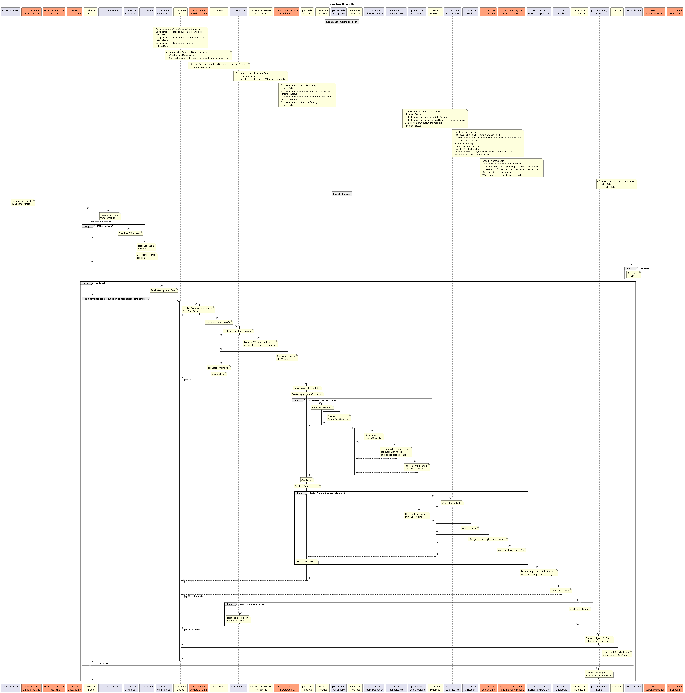
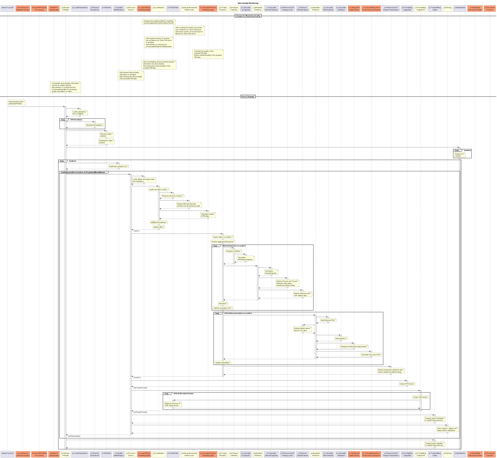
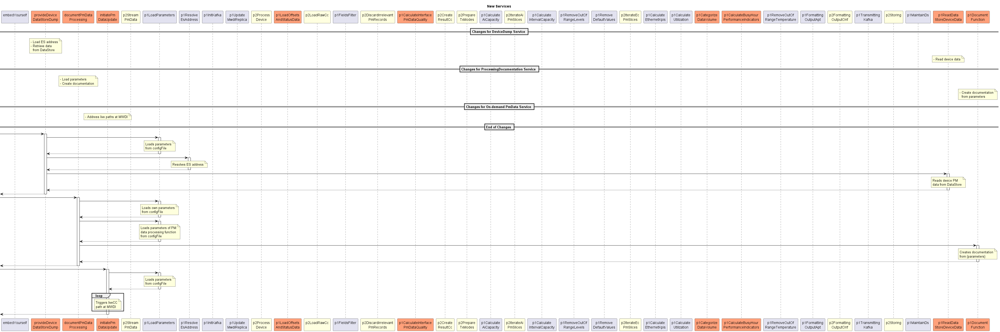
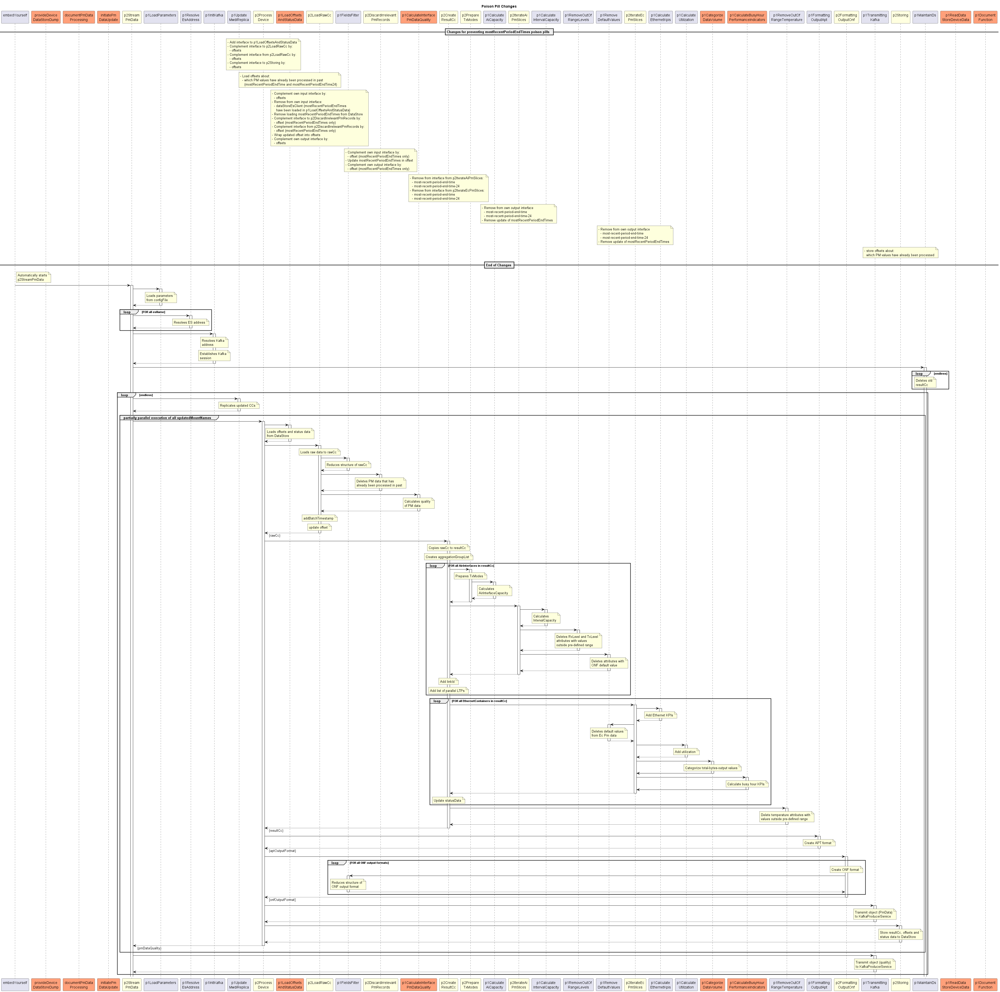
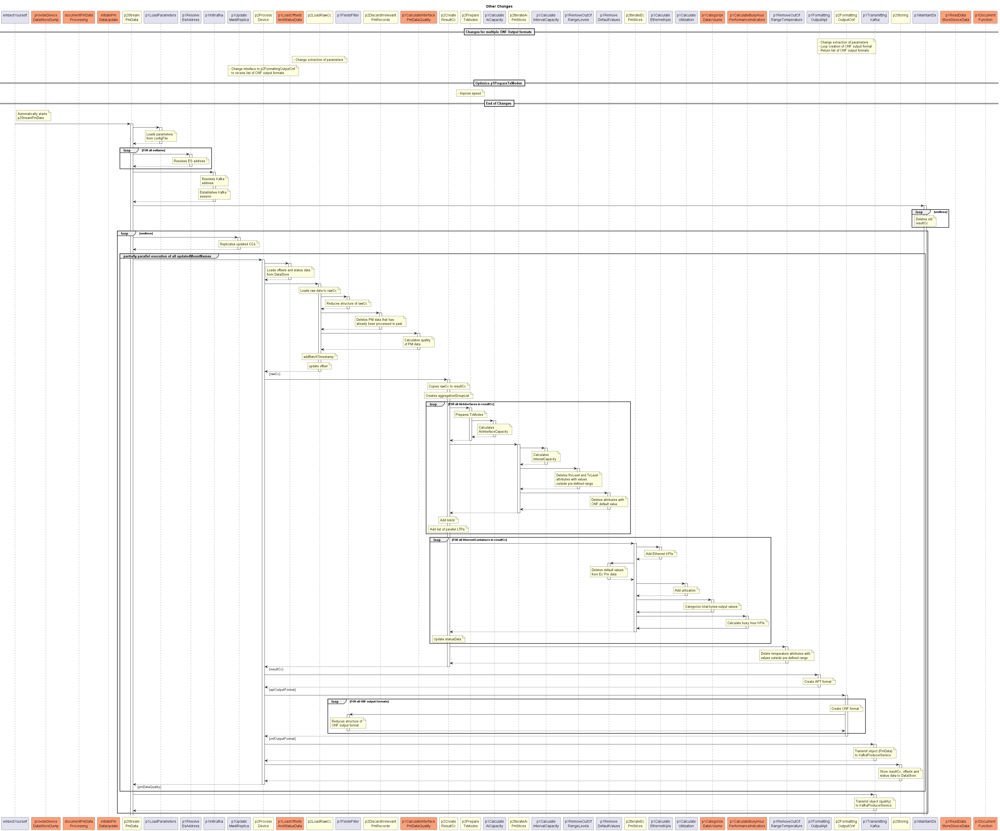
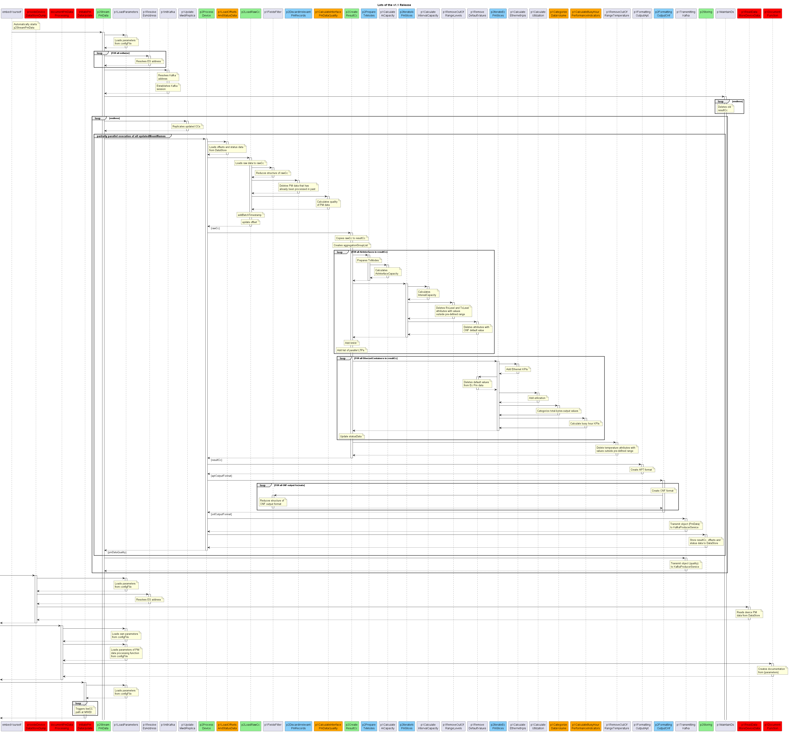

# DevicePerformanceManagementDataProcessor Specification

## API

### ServiceList

- [DevicePerformanceManagementDataProcessor+services](./DevicePerformanceManagementDataProcessor+services.yaml)  

### ProfileList and ProfileInstanceList

- [DevicePerformanceManagementDataProcessor+profiles](./DevicePerformanceManagementDataProcessor+profiles.yaml)  
- [DevicePerformanceManagementDataProcessor+profileInstances](./DevicePerformanceManagementDataProcessor+profileInstances.yaml)  

### ForwardingList

- [DevicePerformanceManagementDataProcessor+forwardings](./DevicePerformanceManagementDataProcessor+forwardings.yaml)  

### Open API specification (Swagger)

- [DevicePerformanceManagementDataProcessor](./DevicePerformanceManagementDataProcessor.yaml)  

### CONFIGfile (JSON)

- [DevicePerformanceManagementDataProcessor+config](./DevicePerformanceManagementDataProcessor+config.json)  

> Dear implementers and testing team,  
> Kafka interface configuration and function documentation are managed by CONFIGfile.  
> Both might change in parallel to implementation phase.  
> Please always use latest CONFIGfile from develop branch.  

### Details about Services

- [embedYourself](./Services/embedYourself)
- [provideDeviceDataStoreDump](./Services/provideDeviceDataStoreDump)
- [documentPmDataProcessing](./Services/documentPmDataProcessing)
- [initiatePmDataUpdate](./Services/initiatePmDataUpdate)

## Internal Structure

### High Level Process

  

### High Level Sequence

Updated functions are marked in yellow.  
New functions and services are marked in orange.  

  

#### New Busy Hour KPIs

  

#### New Quality Monitoring

  

#### New Services

  

#### Poison Pill Changes

  

#### Other Changes

  

#### Lots of the v1.1 Release

Lot 5: LightGreen  
Lot 6: LightSkyBlue  
Lot 7: Orange  
Lot 8: Red  

  

### Details about Functions

- [p2StreamPmData](./Functions/p2StreamPmData/1.0.0)  
  - [p1LoadParameters](./Functions/p2StreamPmData/p1LoadParameters/1.0.0)  
  - [p1ResolveEsAddress](./Functions/p2StreamPmData/p1ResolveEsAddress/1.0.0)  
  - [p1InitKafka](./Functions/p2StreamPmData/p1InitKafka/1.0.0)  
  - [p1UpdateMwdiReplica](./Functions/p2StreamPmData/p1UpdateMwdiReplica/1.0.0)  
  - [p2ProcessDevice](./Functions/p2StreamPmData/p2ProcessDevice/1.0.0)  
    - [p1LoadOffsetsAndStatusData](./Functions/p2StreamPmData/p2ProcessDevice/p1LoadOffsetsAndStatusData/1.0.0)  
    - [p2LoadRawCc](./Functions/p2StreamPmData/p2ProcessDevice/p2LoadRawCc/1.0.0)  
      - [p1FieldsFilter](./Functions/p2StreamPmData/p2ProcessDevice/p2LoadRawCc/p1FieldsFilter/1.0.0)  
      - [p2DiscardIrrelevantPmRecords](./Functions/p2StreamPmData/p2ProcessDevice/p2LoadRawCc/p2DiscardIrrelevantPmRecords/1.0.0)  
      - [p1CalculateInterfacePmDataQuality](./Functions/p2StreamPmData/p2ProcessDevice/p2LoadRawCc/p1CalculateInterfacePmDataQuality/1.0.0)  
    - [p2CreateResultCc](./Functions/p2StreamPmData/p2ProcessDevice/p2CreateResultCc/1.0.0)  
      - [p2PrepareTxModes](./Functions/p2StreamPmData/p2ProcessDevice/p2CreateResultCc/p2PrepareTxModes/1.0.0)  
        - [p1CalculateAiCapacity](./Functions/p2StreamPmData/p2ProcessDevice/p2CreateResultCc/p2PrepareTxModes/p1CalculateAiCapacity/1.0.0)  
      - [p2IterateAiPmSlices](./Functions/p2StreamPmData/p2ProcessDevice/p2CreateResultCc/p2IterateAiPmSlices/1.0.0)  
        - [p1CalculateIntervalCapacity](./Functions/p2StreamPmData/p2ProcessDevice/p2CreateResultCc/p2IterateAiPmSlices/p1CalculateIntervalCapacity/1.0.0)  
        - [p1RemoveOutOfRangeLevels](./Functions/p2StreamPmData/p2ProcessDevice/p2CreateResultCc/p2IterateAiPmSlices/p1RemoveOutOfRangeLevels/1.0.0)  
        - [p1RemoveDefaultValues](./Functions/p2StreamPmData/p2ProcessDevice/p2CreateResultCc/p2IterateAiPmSlices/p1RemoveDefaultValues/1.0.0)  
      - [p2IterateEcPmSlices](./Functions/p2StreamPmData/p2ProcessDevice/p2CreateResultCc/p2IterateEcPmSlices/1.0.0)  
        - [p1CalculateEthernetKpis](./Functions/p2StreamPmData/p2ProcessDevice/p2CreateResultCc/p2IterateEcPmSlices/p1CalculateEthernetKpis/1.0.0)  
        - [p1RemoveDefaultValues](./Functions/p2StreamPmData/p2ProcessDevice/p2CreateResultCc/p2IterateAiPmSlices/p1RemoveDefaultValues/1.0.0)  
        - [p1CalculateUtilization](./Functions/p2StreamPmData/p2ProcessDevice/p2CreateResultCc/p2IterateEcPmSlices/p1CalculateUtilization/1.0.0)  
        - [p1CategorizeDataVolume](./Functions/p2StreamPmData/p2ProcessDevice/p2CreateResultCc/p2IterateEcPmSlices/p1CategorizeDataVolume/1.0.0)  
        - [p1CalculateBusyHourPerformanceIndicators](./Functions/p2StreamPmData/p2ProcessDevice/p2CreateResultCc/p2IterateEcPmSlices/p1CalculateBusyHourPerformanceIndicators/1.0.0)  
      - [p1RemoveOutOfRangeTemperatures](./Functions/p2StreamPmData/p2ProcessDevice/p2CreateResultCc/p1RemoveOutOfRangeTemperature/1.0.0)
    - [p1FormattingOutputApt](./Functions/p2StreamPmData/p2ProcessDevice/p1FormattingOutputApt/1.0.0)  
    - [p2FormattingOutputOnf](./Functions/p2StreamPmData/p2ProcessDevice/p2FormattingOutputOnf/1.0.0)  
      - [p1FieldsFilter](./Functions/p2StreamPmData/p2ProcessDevice/p2LoadRawCc/p1FieldsFilter/1.0.0)  
    - [p1TransmittingKafka](./Functions/p2StreamPmData/p2ProcessDevice/p1TransmittingKafka/1.0.0)  
    - [p2Storing](./Functions/p2StreamPmData/p2ProcessDevice/p2Storing/1.0.0)  
  - [p1MaintainDs](./Functions/p2StreamPmData/p1MaintainDs/1.0.0)  
- [p1ReadDataStoreDeviceData](./Functions/p1ReadDataStoreDeviceData/1.0.0)  
- [p1DocumentFunction](./Functions/p1DocumentFunction/1.0.0)  

### Most relevant Data Structures

- [rawCc](./Functions/p2StreamPmData/p2ProcessDevice/p2LoadRawCc/1.0.0/variables.yaml) :
  pre-filtered raw data from the device  

- [resultCc](./Functions/p2StreamPmData/p2ProcessDevice/p2CreateResultCc/1.0.0/variables.yaml) :
  processed PM data, which is generated by copying the rawCc and applying various clean-up and completion functions  

- output formats:  
  - [apt-output-format](./Functions/p2StreamPmData/p2ProcessDevice/p1FormattingOutputApt/1.0.0/interface.yaml)
    (see /processing/createOutputFromResultCc/output) :
    format already used for device-wise retrieval of PM data  
  - onf-output-format :
    identical with resultCc, but with configurable filtering  

- [data-store](./Functions/p2StreamPmData/p2ProcessDevice/p2Storing/1.0.0/data-store-schema/dataStore.yaml) :
  offsets, status data and PM data that is stored for some configurable time period  

- quality :  
  composed from [device-pm-data-quality](./Functions/p2StreamPmData/p2ProcessDevice/p2LoadRawCc/1.0.0/variables.yaml) and
  [interface-pm-data-quality](./Functions/p2StreamPmData/p2ProcessDevice/p2LoadRawCc/p1CalculateInterfacePmDataQuality/1.0.0/interface.yaml)
  (see /processing/composeInterfacePmDataQuality/output)  
