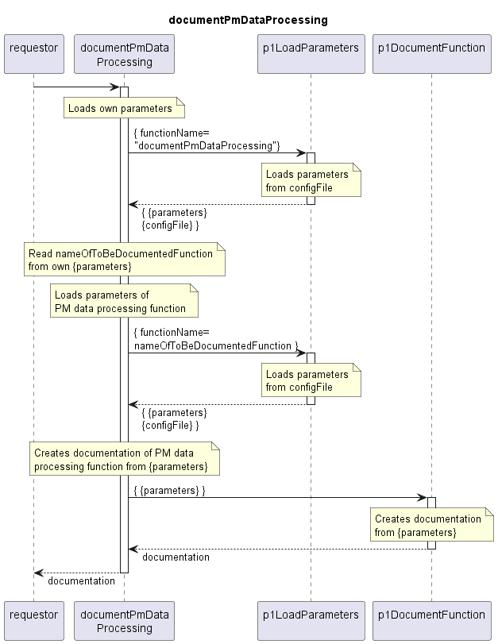

# documentPmDataProcessing

## Overview

The documentPmDataProcessing service can be called on demand.  
It creates documentation about the PM data processing from the configFile of the Application.  
Only active (sub-)functions are considered.  

## Diagram

  

## Interface

Please find a detailed description of the interface in the [openAPI specification](../../../DevicePerformanceManagementDataProcessor.yaml).  

## Variables

Please find a detailed description of the [variables](./variables.yaml).  

## Parameters

| Parameter Name               | Description                                                         |
|------------------------------|---------------------------------------------------------------------|
| nameOfToBeDocumentedFunction | Name of the function for which the documentation shall be generated |
