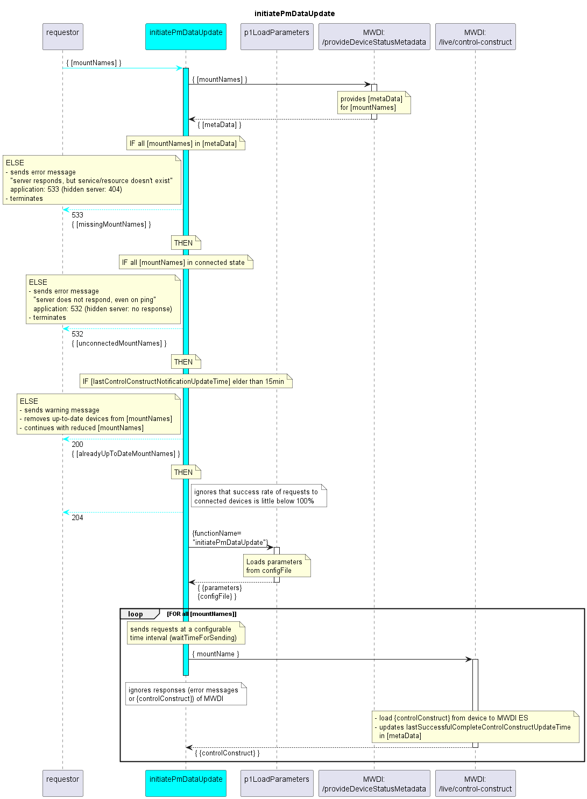

# initiatePmDataUpdate

## Overview

The initiatePmDataUpdate service requires a list of mountNames as input.  
It triggers updating the ControlConstructs of these devices in the MWDI ES.  
Updated ControlConstructs trigger the processing and sending of contained PM data by the DPMDP.  

Additional details on the [initial considerations](../../../additionalDocumentation/onDemandUpdate/onDemandUpdate.md) have been documented.  

## Diagram

  

## Interface

Please find a detailed description of the interface in the [openAPI specification](../../../DevicePerformanceManagementDataProcessor.yaml).  

## Variables

Please find a detailed description of the [variables](variables.yaml).  
