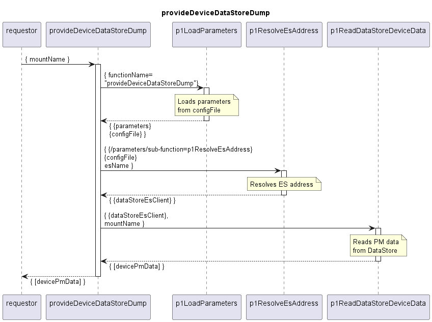

# provideDeviceDataStoreDump

## Overview

The provideDeviceDataStoreDump service can be called on demand.  
It requires the mountName of a target device as input, and reads and returns the PM data for this device from the dataStore.  

## Diagram

  

## Interface

Please find a detailed description of the interface in the [openAPI specification](../../../DevicePerformanceManagementDataProcessor.yaml).  

## Variables

Please find a detailed description of the [variables](variables.yaml).  
