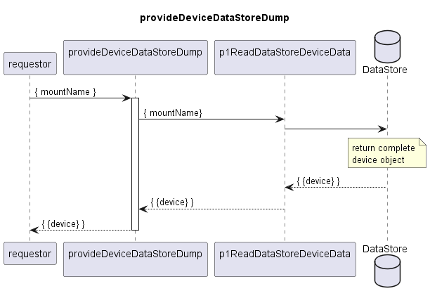

# ProvideDeviceDataStoreDump

### Overview  

The provideDeviceDataStoreDump Service is called on demand.
It returns the complete data from the dataStore found for an input device.

### Diagram  

  

### Interface  

Please find a detailed description of the interface in the [openAPI specification](../../DevicePerformanceManagementDataProcessor.yaml).  

### NPM Module  

