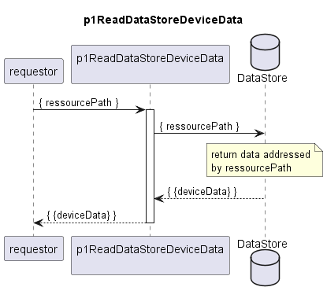

# p1ReadDataStoreDeviceData  

Reads and returns data store content according to the handed over input ressource path.

### Diagram  

  
  

  

### Interface  

Please find a detailed description of the [interface](./interface.yaml).  

### Variables

Please find a detailed description of the [variables](./variables.yaml).
