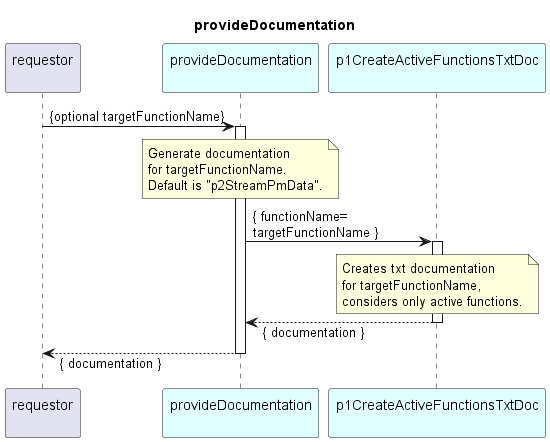

# provideDocumentation

## Overview

The provideDocumentation service can be called on demand.  
It reads the configFile of the Application and generates documentation from it.  
The documentation is either created for the DPMDPs topLevel PM data processing function
(p2StreamPmData) or for an optionally provided input function name (if valid).
Only active (sub-)functions are considered.

## Diagram

  

## Interface

Please find a detailed description of the interface in the [openAPI specification](../../../DevicePerformanceManagementDataProcessor.yaml).  

## Variables

Please find a detailed description of the [variables](variables.yaml).  
