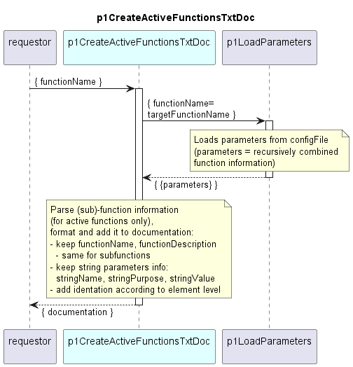

# p1CreateActiveFunctionsTxtDoc

The function p1CreateActiveFunctionsTxtDoc first reads the information for an input functionName from the Application's configFile. The thus obtained information, is recursively combined.
Then it parses this information by the rules laid out below, and generates the documentation as plain text according to the later described format.


## Parsing rules

- Only active functions are to be considered. If a function's IsActive field is not true, the entire function — including all of its sub‑functions at every depth — is skipped.
- For each function object that is active, retain only:
  - functionName
  - description
  - all string parameters, keeping only their
    - parameterName, purpose, and value
- A function can contain string parameters and sub‑functions, but it may also have none of them, depending on the specific function
- Sub‑functions are parsed recursively using the same rules

## Documentation output format

The documentation shall be provided as text in format example given below.
- (Sub-)Function entries must use a hyphen (-) as bullet point
- String parameters must use a dot (.) as bullet point
- Indentation levels must follow a fixed, YAML‑style structure: each nested element is indented consistently using spaces, and all text aligns exactly as shown in the schema.
- Descriptions always appear directly under their respective item, using the same indentation level as the item's label.

```
- functionName
  text of the functionDescription
  . stringName
    text of the stringPurpose
    text of the stringValue
  . stringName
    text of the stringPurpose
    text of the stringValue
  - sub-functionName
    text of the functionDescription
    . stringName
      text of the stringPurpose
      text of the stringValue
    - sub-functionName
      text of the functionDescription
    - sub-functionName
      text of the functionDescription
      - sub-functionName
        text of the functionDescription
  - sub-functionName
    text of the functionDescription
    - sub-functionName
      text of the functionDescription
```


## Diagram

<p align="center">
  
</p>

## Interface

Please find a detailed description of the [interface](./interface.yaml).  

## Variables

Please find a detailed description of the [variables](./variables.yaml).  

## NPM Module

[mw-sdn-p1-read-data-store-device-data](https://www.npmjs.com/package/mw-sdn-p1-read-data-store-device-data)  
