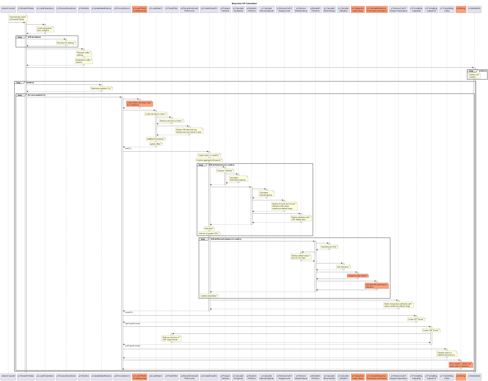

# Calculating the Busy Hour KPIs

This document relates to the design applied for the DPMDP v1.1.  
There is no process established for updating it in case of later releases.  

### Problem

The basic structure of the DPMDP has been designed to optimize the speed of processing newly available PM data.  

This means:  
- The processing inside the DPMDP is triggered by the availability of an updated ControlConstruct in the MWDI.
- The first step in the processing is to exclude old data from further processing.
  
The DPMDP thinks and works in batches of 15 minutes PM data (24 hours PM data provided by the device is not relevant for busy hour KPIs).  
On the other hand, for calculating the busy hour KPIs, data relating to hours must be processed in the context of data relating to days.  
15 minutes PM data slices must be aggregated to hours.  
Data concerning the same hour might be distributed across different batches.  
Multiple batches are needed to get the full data of a day.  

This requires storing status information and spill-over data between the processing of different batches.  

### Busy Hour Definition

Die busy hour bezieht sich auf einen individuellen EthernetContainer (logisches Ethernet Interface).  
Es gibt genau eine busy hour pro Kalendertag.  
Die busy hour stellt den Beobachtungszeitraum dar, während dem an diesem Kalendertag die maximale Datenmenge übertragen wurde.  

Beobachtungszeiträume beginnen und enden zur vollen Stunde.  
D.h. es ergeben sich genau 24 Beobachtungszeiträume pro Kalendertag.  

Die Messung der übertragenen Datenmenge bezieht sich nicht auf Stunden, sondern auf 15 Minuten lange Perioden.  
Es wird unterstellt, dass die Geräte so programmiert sind, dass die 15-Minuten-Messperioden zur vollen Stunde (und 15, 30 bzw. 45 Minuten danach) beginnen.  

Die im Beobachtungszeitraum übertragene Datenmenge berechnet sich als Summe der Datenmengen, die in den vier Messperioden, die in den Beobachtungszeitraum fallen, gemessen wurden.  
Als Messwert wird das folgende Attribut ausgewertet /ethernet-container-2-0:ethernet-container-pac/ethernet-container-historical-performances/historical-performance-data-list/performance-data/total-bytes-output  
Die offizielle semantische Definition des Messwertes lautet: "Total number of Bytes of Ethernet traffic (before header compression) transmitted (in direction out of the device) during the measurement period."  
Die Maßeinheit des Messwertes lautet: Byte  
Es handelt sich damit um eine reine Mengenangabe, keine Flussgröße.  
Sollten weniger als die vier erwarteten Messwerte vorliegen, werden nur die vorhandenen Messwerte addiert.  

### Busy Hour Performance Indicators

Die Busy Hour Performance Indikatoren werden zusammen mit den anderen Performance Indikatoren des selben Kalendertages prozessiert und im resultCc gespeichert.  
Es wird unterstellt, dass die Geräte so programmiert sind, dass die 24-Stunden-Messperioden jeweils mit dem Kalendertag beginnen.  

Der Name und der Ort des kombinierte Datentyps lautet:  
/ethernet-container-2-0:ethernet-container-pac/ethernet-container-historical-performances/historical-performance-data-list/busy-hour  
Er erscheint ausschließlich in Instanzen von historical-performance-data-list mit einer granularity-period von 24 Stunden.  

Der kombinierte Datentyp enthält folgende Attribute:  
- period-end-time-list  
- label  
- throughput  
- capacity  
- utilization  
- errored-frames  
- dropped-frames  
- suspicious-result-flag  

#### busy-hour::period-end-time-list
Liste der Werte des period-end-time Attributes der bis zu vier Messperioden, die zusammen die busy hour bilden.  
Mit diesen Werten können die Messperioden für weitere Analysen adressiert werden.  

#### busy-hour::label
Die volle Stunde zu Beginn der busy hour wird in folgendem Format dargestellt: YYYY/MM/DD/hh/mm.  
Mit diesen Werten wird die busy hour in anderen Tools und Datenvorräten bezeichnet.  

#### busy-hour::throughput
Der busy hour throughput ist die Datenmenge, die während der busy hour hypothetisch im Mittel in einer (=1) der 3600 Sekunden gesendet wurde.  
Es handelt sich also um eine Flussgröße keine reine Menge.  
Die Einheit des busy hour throughput ist bit/s.  
D.h. die in Bytes ausgedrückte Datenmenge in der busy hour ist in bits umzurechnen und durch die statisch angenommene Länge des Beobachtungszeitraums (3600 Sekunden) zu teilen.  
Die Mittelwertbildung über 3600 Sekunden wirkt stark glättend.  
Dass die aufsummierte Länge der Messperioden von 3600 Sekunden abweichen könnte, wird ignoriert.  

#### busy-hour::capacity
Die in der busy hour verfügbare capacity, ist die dem EthernetContainer während der busy hour im Mittel bereitgestellte Übertragungskapazität.  
Hierfür werden die total-air-interface-interval-capacity Werte, die in den bis zu vier Messperioden, die in die busy hour fallen, dokumentiert wurden, addiert.  
Die semantische Definition des total-air-interface-interval-capacity Attributes lautet: "Sum of the intervalCapacity of all AirInterfaces in the aggregation group that is transporting this EthernetContainer in kbps."  
Die semantische Definition des intervalCapacity Attributes am AirInterface lautet: "AirInterface capacity weighted by duration of operation of the respective transmission mode in kbps."  
Die Einheit der total-air-interface-interval-capacity Werte ist kbit/s.  
Sie Summe der total-air-interface-interval-capacity Werte wird statisch durch vier geteilt und mit 1000 multipliziert.  
Die Einheit der busy-hour::capacity Werte ist bit/s.  
Dass weniger als vier Werte zu Verfügung stehen könnten, wird ignoriert.  

#### busy-hour::utilization
Die busy-hour::utilization berechnet sich als Quotient aus busy-hour::throughput und busy-hour::capacity und wird mit 100 multipliziert.  
Die Einheit der busy-hour::utilization Werte ist %.  
Es wird angenommen, dass im Falle von unvollständigen Messwerten nicht einzelne Performancewerte innerhalb einer Messperiode, sondern alle Daten einer Messperiode fehlen.  
D.h. obwohl das Fehlen von Messwerten sowohl bei der Berechnung des throughput als auch bei der Berechnung der capacity ignoriert wird, könnte sich dennoch ein halbwegs repräsentativer busy-hour::utilization Wert ergeben.  

#### busy-hour::errored-frames
Die bis zu vier errored-frames-input [frame] Werte, die in den Messperioden, die in die busy hour fallen, dokumentiert wurden, werden addiert.  
Die offizielle semantische Definition des errored-frames-input Attributes lautet: "Total number of errored frames received at this interface."  
Die errored-frames sind eine reine Mengenangabe und die Einheit ist frame.  
Dass weniger als vier Werte zu Verfügung stehen könnten, wird ignoriert.  

#### busy-hour::dropped-frames
Die bis zu vier dropped-frames-input [frame] Werte, die in den Messperioden, die in die busy hour fallen, dokumentiert wurden, werden addiert.  
Die offizielle semantische Definition des dropped-frames-input Attributes lautet: "Total number of Ethernet frames dropped at the receiver. The number of input Ethernet frames, for which no problems were encountered to prevent their continued processing, but were discarded (e.g., for lack of buffer space)."  
Die dropped-frames sind eine reine Mengenangabe und die Einheit ist frame.  
Dass weniger als vier Werte zu Verfügung stehen könnten, wird ignoriert.  


# Module

Das Problem zerfällt in folgende Segmente:  

- Lesen von Offsets und Statusdaten => p1LoadOffsetsAndStatusData  
  Offsets und Statusdaten werden zu Beginn der Verarbeitung eines Batches aus dem DataStore gelesen.  

- Kategorisierung der Datenmengen => p1CategorizeDataVolume  
  Die übertragenen Datenmengen, die in 15-Minuten-Messperioden dokumentiert wurden, werden nach Tagen und Label (Beobachtungszeiträume von einer Stunde) kategorisiert.  
  Neben total-bytes-output werden auch period-end-time, total-air-interface-interval-capacity, errored-frames-input und dropped-frames-input kategorisiert.  
  Da die Kategorisierung über die Grenzen der einzelnen Batches hinweg bestehen und vervollständigt werden muss, wird sie als Statusdaten in den DataStore geschrieben.  
  Falls 15-minute-values-by-day länger als zwei Einträge geworden ist, werden die ältesten Einträge gelöscht (älter als der Wert 1 ist beispielsweise der Wert 31).  

- Feststellen der busy hour und Berechnung der busy hour performance indicators => p1CalculateBusyHourPerformanceIndicators  
  Sobald die 24-Stunden-Messwerte eines Tages vorliegen, wird angenommen, dass mit dem aktuellen und den vorherigen Batch alle 15-Minuten-Messwerte eingetroffen und kategorisiert wurden.  
  Als Teil der Verarbeitung der 24-Stunden-Messwerte werden die Datenmengen in den jeweiligen Beobachtungszeiträumen aggregiert.  
  Die resultierenden 24 aggregierten Datenmengen werden verglichen.  
  Der Beobachtungszeitraum mit der höchsten aggregierten Datenmenge wird zur busy hour definiert.  
  In den 24-Stunden-Messdaten wird das busy-hour Attribut angelegt.  
  label und period-end-time-list werden mit den Werten der busy hour befüllt.  
  Die restlichen busy hour performance indicators werden wie oben beschrieben aus den Messwerten der busy hour berechnet und in das busy-hour Attribut eingetragen.  

- Speichern der Statusdaten => p2Storing  
  Statusdaten (total-bytes-output values of already processed 15-minute periods) werden am Ende der Verarbeitung eines Batches in den DataStore geschrieben.  

<p align="center">
  
</p>


# Aufrufe und Übergaben

- p1CategorizeDataVolume  
  p1CategorizeDataVolume wird von p2IterateEcPmSlices innerhalb der Schleife zur Bearbeitung der einzelnen Messperioden aufgerufen.  
  Nach dem Ausführen von p1CalculateUtilization wird geprüft, ob die Messperiode eine 15-Minuten-Messperiode ist.  
  Falls ja, wird p1CategorizeDataVolume aufgerufen.  
  Übergeben werden:  
  - historical-performance-data der aktuellen Messperiode  
  - status der p1CategorizeDataVolume Funktion ( /status-data=p1CategorizeDataVolume/status )  
  Zurückgegeben wird:  
  - status der p1CategorizeDataVolume Funktion  
```
status:
  type: object
  required:
    - 15-minute-values-by-day
  properties:
    15-minute-values-by-day:
      type: array
      x-key: day
      minItems: 0
      maxItems: 2
      items:
        type: object
        required:
          - day
          - 15-minute-values-by-label
        properties:
          day:
            type: integer
            minimum: 1
            maximum: 31
          15-minute-values-by-label:
            type: array
            x-key: label
            minItems: 24
            maxItems: 24
            items:
              type: object
              required:
                - label
                - 15-minute-values-by-period-end-time
              properties:
                label:
                  type: integer
                  minimum: 0
                  maximum: 23
                15-minute-values-by-period-end-time:
                  type: array
                  x-key: period-end-time
                  minItems: 0
                  maxItems: 4
                  items:
                    type: object
                    required:
                      - period-end-time
                    properties:
                      period-end-time:
                        type: string
                      total-bytes-output:
                        type: integer
                      total-air-interface-interval-capacity:
                        type: integer
                      errored-frames-input:
                        type: integer
                      dropped-frames-input:
                        type: integer
```

- p1CalculateBusyHourPerformanceIndicators  
  p1CalculateBusyHourPerformanceIndicators wird von p2IterateEcPmSlices innerhalb der Schleife zur Bearbeitung der einzelnen Messperioden aufgerufen.  
  Nach dem Ausführen von p1CalculateUtilization wird geprüft, ob die Messperiode eine 24-Stunden-Messperiode ist.  
  Falls ja, wird p1CalculateBusyHourPerformanceIndicators aufgerufen.  
  Übergeben werden:  
  - historical-performance-data der aktuellen Messperiode  
  - status der p1CategorizeDataVolume Funktion ( /status-data=p1CategorizeDataVolume/status )  
  Zurückgegeben wird:  
  - historical-performance-data der aktuellen Messperiode  
