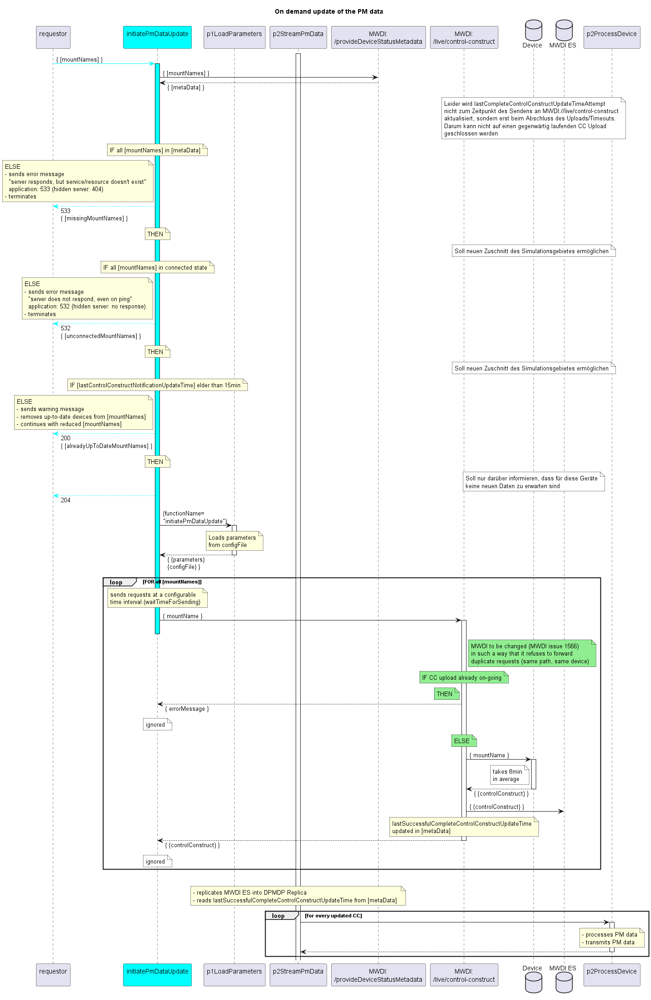

# On-demand update

This document relates to the design applied for the DPMDP v1.1.  
There is no process established for updating it in case of later releases.  

## Problem

Performance Daten werden nicht nur für die langfristige Link-Analyse, sondern auch für kurzfristige Netzwerkanalysen benötigt.  
Zum Start einer solchen Netzwerkanalyse sollen die zugrundeliegenden PM Daten noch einmal auf den neuesten Stand gebracht werden.  

## Lösungsansatz

### Datenmenge

Es ist nicht möglich, gezielt die aktuellsten PM Daten von den Geräten zu laden.  
=> Es müssen immer alle PM Daten eines Interfaces hochgeladen werden, selbst wenn nur eine geringe Menge davon neu ist.  

Die Interfaces sind in den konsumierenden Tools durch Link-IDs und Polarisationen identifiziert.  
Auf den Geräten sind die Interfaces durch UUIDs und Local IDs identifiziert.  
=> Wenn das konsumierende Tool PM Daten für einzelne Interfaces aktualisieren wollen würde, müsste eine Übersetzung implementiert werden werden.  

Die PM Daten machen rund 80% des Volumens im Datenbaum eines Geräts aus.  
Die PM Daten liegen nicht an einer Stelle des Datenbaums, sondern sind über die einzelnen Interfaces verteilt.  
=> Die Adressierung ist nicht trivial, auch weil sich die Pfade technologiespezifisch unterscheiden.  

Fazit:  
Das Datenvolumen der PM Daten ist hoch, auch relativ zum gesamten Datenbaum eines Gerätes.  
Eine Reduzierung des Datenvolumens würde die Komplexität der Lösung deutlich erhöhen.  

### Konsolidierung der Prozesse

Die on-demand aktualisierten PM Daten werden im Zielsystem in die selbe Datenbank geschrieben wie die PM Daten, die durch die regelmäßigen Updates aktualisiert werden.  
=> D.h. das on-demand Update wirkt wie ein vorgezogenes reguläres Update, das die zukünftig noch benötigten Daten um die nun aktualisierten Daten reduziert.  

Die bereits gelieferten PM Daten werden im DPMDP in den Offset-Tabellen des streamPmData Prozesses dokumentiert.  
Es wäre intransparent und fehleranfällig, wenn diese Offset-Tabellen von einem zweiten Prozess verändert werden würden.  

Fazit:
Die on-demand Aktualisierung der PM Daten durch den streamPmData Prozess reduziert die Gesamtkomplexität und zukünftige Wartungsaufwände erheblich.  

### Initiierung

Der streamPmData Prozess wird durch eine Aktualisierung der ControlConstructs im MWDI ES Index getriggert.  
=> Die on-demand Lieferung der PM Daten besteht letztendlich darin, eine Aktualisierung des ControlConstructs im MWDI auszulösen.  

### Anordnung

Die on-demand Aktualisierung von Daten im MWDI wird durch die Adressierung der entsprechenden live-Pfade ausgelöst.  
Der Vorgang erzeugt Last auf den Gerätecontrollern und im DCN.  
=> Es sind Schutzmechanismen vorzusehen.  

Durch die Auswertung domain-interner Daten lässt sich die Anzahl der Anfragen an die Geräte reduzieren.  

Die Adressierung der live-Pfade hinter einem Serviceaufruf zu verbergen, ermöglicht spezifischere Rückmeldungen an die Toolebene.  

## Diagramm

