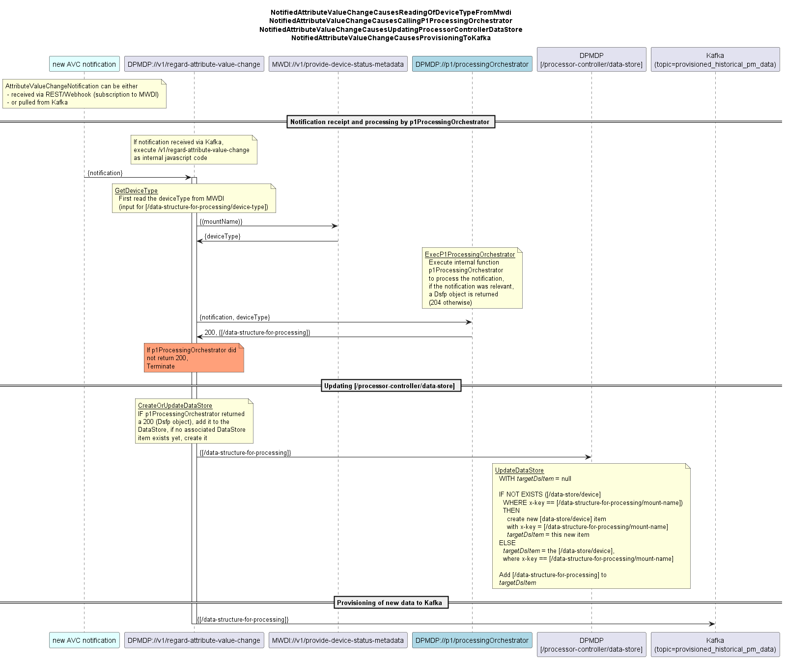

# regardAttributeValueChange


### Overview

Receives AVC notifications from MWDI.  
Filters for AVC notifications relating to the *HistoricalPerformances::timeOfLatestChange attribute at AirInterface and EthernetContainers.  
Groups these notifications by MountName.  
Stores them until the DPMDP ElasticSearch index has been updated by replicating the MWDI ElasticSearch index.  
Triggers the device-wise processing of the PM data after recognizing the DPMDP ElasticSearch index being updated.


### Timing  

The AVC notification is describing a change to an attribute in the MWDI ES index.  
The periodic replication of the MWDI ElasticSearch index to the DPMDP ElasticSearch index is causing a delay.  
The attribute referenced in the AVC notification can be assumed not yet to be updated in the DPMDP ElasticSearch index when the AVC notification is received.  
The delay depends on the periodicity that is configured into the cronjob in ES.  
This configuration is unknown to the DPMDP, respectively the application layer in general.  
To overcome this lack of information and to synchronize the DPMDP to the cyclic update of its ES index, the following process shall be used.  

After the regardAttributeValueChange received the first AVC notification, it shall regularly (e.g. once within a second) check the DPMDP ElasticSearch index for the referenced attribute having the new value.  
The time period between receiving the first AVC notification and measuring an updated ES shall be defined to be the expected period length.  

During the next period, the regardAttributeValueChange shall  
- start to regularly check the DPMDP ElasticSearch index not before a waiting period of 5s less than the expected period length has passed and  
- stop to regularly check the DPMDP ElasticSearch index after a waiting period of 10s more than the expected period length.

As soon as checking proofed the DPMDP ES index to be updated, or the waiting period being exceeded, the regardAttributeValueChange shall initiate the device-wise processing of the PM data.  

```
The waiting period begins upon receipt of the first AVC notification (a phase in which no notifications are received does not lead to an extension of the period duration).

Expected period length at time t=0:
    Te(0) = 0s
Time of the first check for DPMDP ES containing the new value indicated in the first AVC notification:
    Tc1(n) = Te(n-1) – 5s
Maximum waiting period length:
    Tw(n) = Te(n-1) + 10s

Length of period n:  
    Te(n) = Tc1(n) <  time of first successful query in period n < Tw(n)
    Te(n) = (Te(n-1) – 5s) <  time of first successful query in period n < (Te(n-1) + 10s)
```


### Period End  

The regardAttributeValueChange categorized the incoming AVC notifications by MountName.  

At the end of the waiting period, it is initiating an instance of p1ProcessingOrchestratorFor15MinHistoricalPmData for every MountName it received during that period.  

MountNames that are processed in one period are blocked for the next period, because receiving notifications might reach across the border between the two periods.  

The way of implementing the initiation of multiple p1ProcessingOrchestratorFor15MinHistoricalPmData instances assures a smooth resource consumption.  


### Outlook  

Future release of the regardAttributeValueChange might distinguish different cases of AVC notifications and trigger alternative ProcessingOrchestrators.  


### Diagram  


